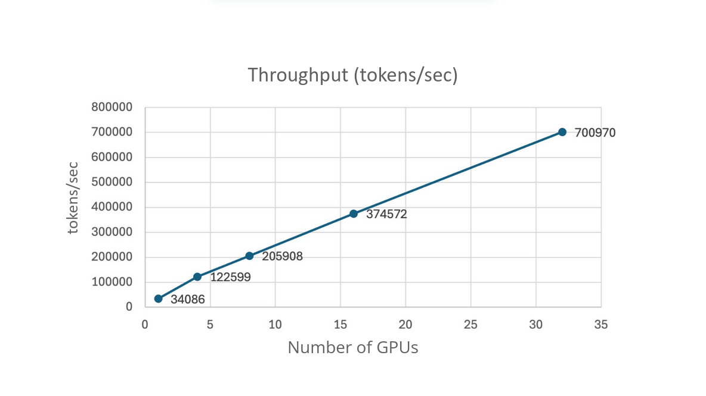
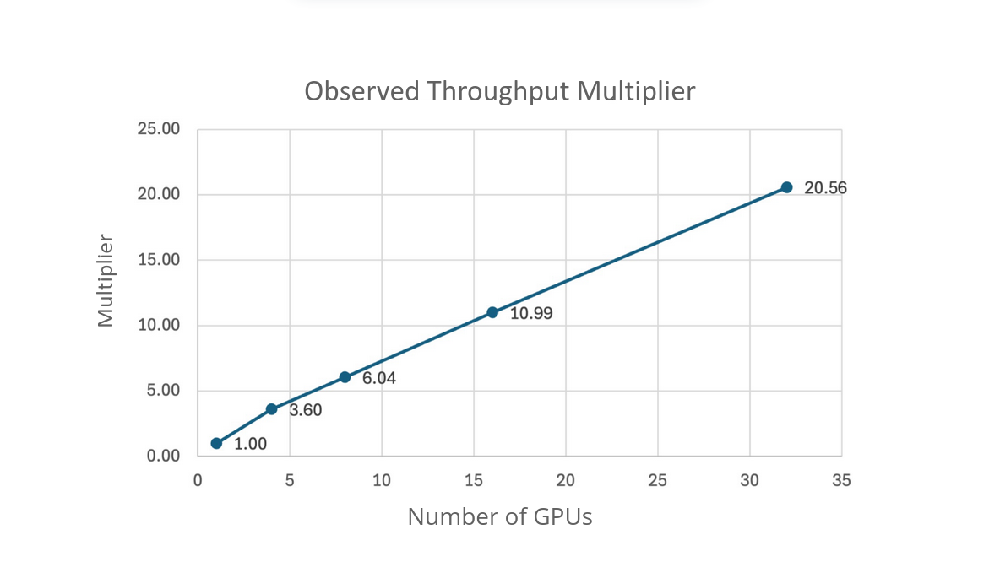

# Throughput Scaling Analysis for LLM Training

## Introduction

This report evaluates the scalability characteristics of distributed training by measuring token processing rates across various multi-GPU and multi-node configurations.

The analysis focuses on the following metrics:

- **Overall Throughput**: Total tokens processed per second across all GPUs
- **Throughput per GPU**: Total tokens processed per second for a single GPU
- **Scaling Multiplier**: How much faster multi-GPU setups are compared to single GPU

All measurements were conducted over **1,500 training steps**.

## Results

| Configuration          | Total Tokens Processed | Overall Throughput (tokens/sec) | Throughput per GPU | Elapsed Time (s) | Elapsed Time (min) |
| ---------------------- | ---------------------: | ------------------------------: | -----------------: | ---------------: | -----------------: |
| 1 GPU across 1 node    |             33,792,000 |                          34,086 |             34,086 |           991.38 |               16.5 |
| 4 GPUs across 1 node   |            135,168,000 |                         122,599 |             30,650 |          1102.52 |               18.4 |
| 8 GPUs across 2 nodes  |            270,336,000 |                         205,908 |             25,739 |          1312.90 |               21.9 |
| 16 GPUs across 4 nodes |            540,672,000 |                         374,571 |             23,411 |          1443.44 |               24.1 |
| 32 GPUs across 8 nodes |          1,081,344,000 |                         700,972 |             21,905 |          1542.64 |               25.7 |

The throughput comparison shows both the absolute performance gains and the per-GPU efficiency trade-offs inherent in distributed training.

The scaling multiplier plot reveals the efficiency characteristics of distributed training. While we achieve significant speedups, the efficiency decreases as we scale up.
